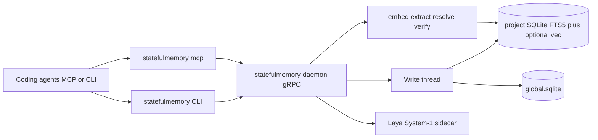

# statefulmemory

<p align="center">
  
</p>

**Persistent memory infrastructure for AI coding agents.**

Thin CLI + MCP → gRPC daemon → per-project SQLite (FTS5 + optional hybrid
BM25/dense). Run **self-hosted** on your machine or team, or use **StatefulMemory
Cloud** (managed SaaS) when you want hosting done for you.

**Docs:** [https://statefulmemory.dev](https://statefulmemory.dev)

[](https://github.com/sanudatta11/statefulmemory/actions/workflows/ci.yml)
[](#license)

## What is StatefulMemory?

statefulmemory stores decisions, patterns, fixes, and notes under `~/.statefulmemory/` as
inspectable SQLite. Agents reach it through the CLI or MCP. The daemon
auto-starts on first use.

## Why do I need it?

Coding agents forget across sessions; chat history is not project memory.
Capture a decision once, retrieve it next session. Optional code anchors let
stale claims withdraw when git moves.

## How is it different?

Memory as **infrastructure for coding agents** — with a real self-host path
(inspectable SQLite, MCP install targets, code anchors) **and** a Cloud SaaS
path for teams that want managed hosting. Not a bare vector index.

Engineering comparison: [Why StatefulMemory?](https://statefulmemory.dev/docs/why-statefulmemory/)

## Install

### Homebrew

```bash
brew install sanudatta11/tap/statefulmemory   # auto-taps; then plain `brew install statefulmemory` works too
statefulmemory --version                     # same binary as: smem --version / sm --version
statefulmemory install                       # wire agents (MCP), git hooks, Laya sidecar
```

### Build from source

**Needs:** Rust stable (≥ 1.75), `protoc`, OpenSSL/`pkg-config`, macOS or Linux
(WSL OK). Windows is out of scope for v1. **Python 3.10+** is optional but
recommended so `install` can set up the Laya System-1 sidecar out of the box.

```bash
git clone https://github.com/sanudatta11/statefulmemory && cd statefulmemory
make prereqs && make install    # → ~/.local/bin/statefulmemory (+ smem, sm)
export PATH="$HOME/.local/bin:$PATH"
statefulmemory --version        # same binary as: smem --version / sm --version
```

Full guide: [Install](https://statefulmemory.dev/docs/install/).
Laya sidecar: [`tools/laya-sidecar/README.md`](tools/laya-sidecar/README.md).

## 30-second example

```bash
smem install --agent cursor     # or: statefulmemory install / sm install
# installs skills/MCP + Laya sidecar prereqs (venv, deps, local spawn)
# skip Laya with: smem install --no-laya
SID=$(uuidgen)
smem obs save --type decision \
  --title "use pgx not GORM" \
  --content "Team prefers raw SQL via pgx" \
  --session "$SID"
smem obs context --query "database access layer" --limit 10
smem decide "Should we keep pgx?"
```

Agents use MCP (`smem mcp` / `sm mcp` / `statefulmemory mcp`) or shell-out. **Python/TypeScript SDKs are not
shipped.** Preference-evolution walkthrough:
[`demos/preference-evolution.sh`](demos/preference-evolution.sh).

### Laya System-1 (decide / conflict / query router)

Optional non-autoregressive typed-decision sidecar ([Laya](https://huggingface.co/convaiinnovations/laya)).
Not an embedder or reranker — search/context stay BM25 + BGE + local CE.

| What | Where |
| --- | --- |
| Config | `[laya]` in `~/.statefulmemory/config.toml` (filled by install) |
| Sidecar app | `~/.statefulmemory/laya-sidecar/` |
| Python venv | `~/.statefulmemory/laya-venv/` |
| Manual start | `make laya-sidecar` or `~/.statefulmemory/laya-sidecar/run.sh` |

Details: [`tools/laya-sidecar/README.md`](tools/laya-sidecar/README.md) · [`AGENTS.md`](AGENTS.md).

## Architecture



Retrieval stays local (BM25 + BGE + optional local CE). Optional **Laya**
provides non-autoregressive typed decisions for query routing, Decide, and
conflict resolution — soft-fails to heuristics / agent CLI. Details:
[`tools/laya-sidecar/README.md`](tools/laya-sidecar/README.md).

Details: [Architecture](https://statefulmemory.dev/docs/architecture/).

## Benchmarks

Local LoCoMo / staleness analysis lives in the eval harness. Public claims wait
for disclosed, stratified scorecards — see [LoCoMo eval](https://statefulmemory.dev/docs/locomo/).
Do not quote smoke or tiny slices against published leaderboards.

<!-- scorecard-start -->
> **Auto-updated on every push to main.** Last run: `dev` (2026-09-22)
> **Note:** Smoke benchmark only — not full stratified LoCoMo eval.

| Metric | Value |
|---|---|
| **LoCoMo Accuracy** | 100.00% |
| **Recall@k** | 1.0000 |
| **MRR** | 1.0000 |
| **Multi-hop Accuracy** | n/a |
| **Retrieval Latency (p50)** | 0.4 ms |
| **Retrieval Latency (p95)** | 0.4 ms |
| **End-to-End Latency (p50)** | 610.5 ms |
| **Benchmark** | Locomo (bm25, w=0) |
| **Eval Gate** | pass |
<!-- scorecard-end -->

## Integrations

| Surface | Status |
|---|---|
| MCP: `memory_search`, `memory_recent`, `memory_context`, `memory_add`, `memory_facts`, `memory_health`, `memory_decide`, `memory_graph_query` | Shipped (`statefulmemory mcp`) |
| `statefulmemory install` / `smem install` / `sm install` — Claude Code, Cursor, Windsurf, Antigravity, OpenCode, Kimi Code, ZCode, `.agents`, VS Code, Copilot CLI, Copilot, Gemini CLI, Codex, Amazon Q | Shipped |
| Laya System-1 sidecar (typed router / decide / conflict) | Shipped (`install` sets up local venv; `--no-laya` to skip) |
| LangGraph, OpenAI Agents SDK, CrewAI, AutoGen, LlamaIndex, Vercel AI SDK | **Not yet** |

```bash
statefulmemory install                 # auto-detect (same: smem install / sm install)
statefulmemory install --agent cursor
statefulmemory install --all
statefulmemory install --no-laya       # skip Laya System-1 sidecar prereqs
```

Full matrix: [Integrations](https://statefulmemory.dev/docs/integrations/).

## Self-hosting

**Shipped today:** per-user daemon on a Unix domain socket (auto-spawned), or
team mode over TCP+TLS + bearer tokens (`statefulmemory team init-ca`,
`STATEFULMEMORY_LISTEN=tcp://…`) on infrastructure you run.

Guide: [Self-hosting](https://statefulmemory.dev/docs/self-hosting/).

## Cloud SaaS

**StatefulMemory Cloud** is the managed SaaS offering for teams that want persistent
agent memory without operating the daemon themselves. Same product thesis
(coding-agent memory, MCP/CLI clients); hosting and ops on us.

Self-host remains first-class and open source. Cloud details and signup will
land on [statefulmemory.dev](https://statefulmemory.dev) as the service rolls out — see
[Self-hosting](https://statefulmemory.dev/docs/self-hosting/#cloud-saas) for how the
modes relate.

## Roadmap

Public directions (graphify bridge, multi-relation judge, eval CI):
[`docs/ROADMAP.md`](docs/ROADMAP.md). Contributor notes:
[`AGENTS.md`](AGENTS.md) / [`CLAUDE.md`](CLAUDE.md).

## Demo

<p align="center">
  <a href="https://statefulmemory.dev/videos/overview-v2.mp4">
    
  </a>
  <br />
  <em>Overview (click to play) — more clips on <a href="https://statefulmemory.dev/">statefulmemory.dev</a></em>
</p>

## Docs

- [Why StatefulMemory?](https://statefulmemory.dev/docs/why-statefulmemory/)
- [Architecture](https://statefulmemory.dev/docs/architecture/)
- [Getting started](https://statefulmemory.dev/docs/getting-started/)
- [Install](https://statefulmemory.dev/docs/install/) · [Integrations](https://statefulmemory.dev/docs/integrations/) · [Self-hosting and Cloud](https://statefulmemory.dev/docs/self-hosting/)
- [Observations](https://statefulmemory.dev/docs/observations/) · [Search and context](https://statefulmemory.dev/docs/search-context/)
- [Anchors and verify](https://statefulmemory.dev/docs/anchors-verify/) · [Decide](https://statefulmemory.dev/docs/decide/) · [Mem archives](https://statefulmemory.dev/docs/mem/)
- [Config](https://statefulmemory.dev/docs/config/) · [LoCoMo eval](https://statefulmemory.dev/docs/locomo/) · [Commands](https://statefulmemory.dev/docs/commands/)

## Contributing

See [`CONTRIBUTING.md`](CONTRIBUTING.md).

```bash
cargo build --workspace --tests
cargo test --workspace --lib
```

## License

Licensed under either of

- Apache License, Version 2.0 ([`LICENSE-APACHE`](LICENSE-APACHE) or
  https://www.apache.org/licenses/LICENSE-2.0)
- MIT license ([`LICENSE-MIT`](LICENSE-MIT) or
  https://opensource.org/licenses/MIT)

at your option.

Unless you explicitly state otherwise, any contribution intentionally submitted
for inclusion in statefulmemory by you shall be dual-licensed as above, without any
additional terms or conditions.
