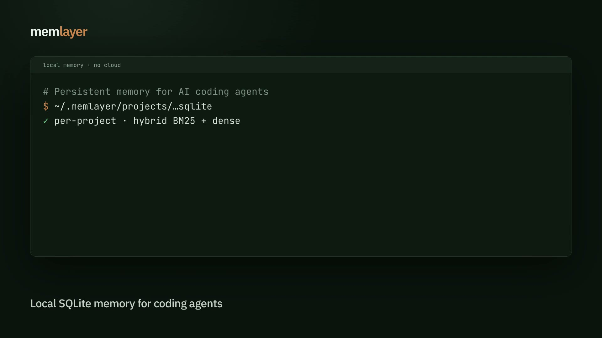
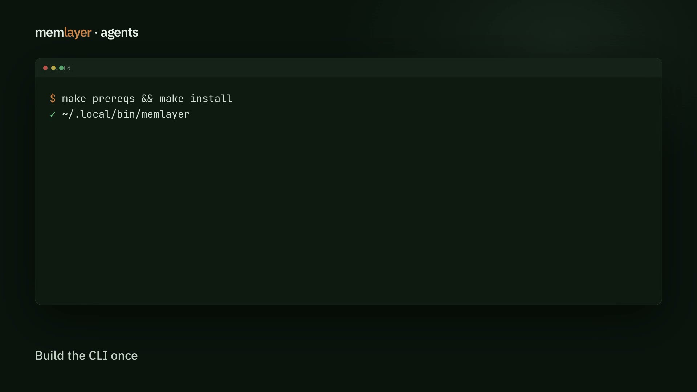
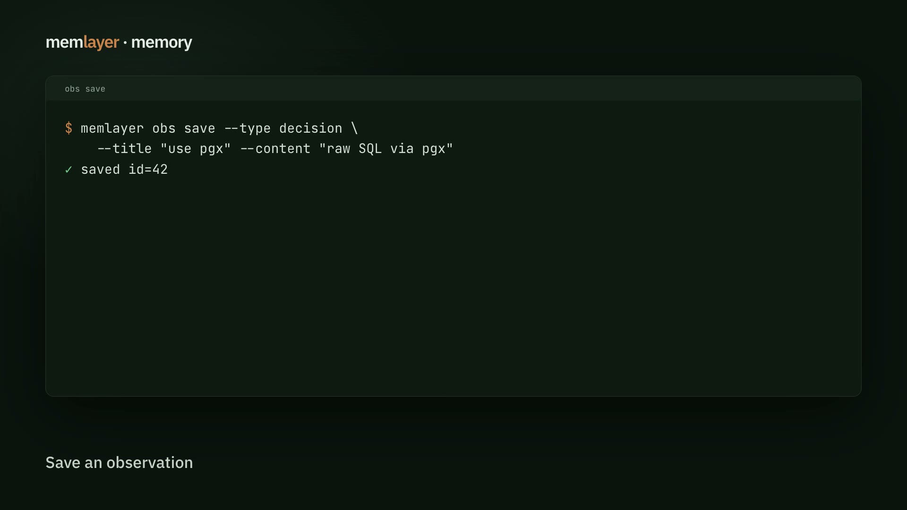
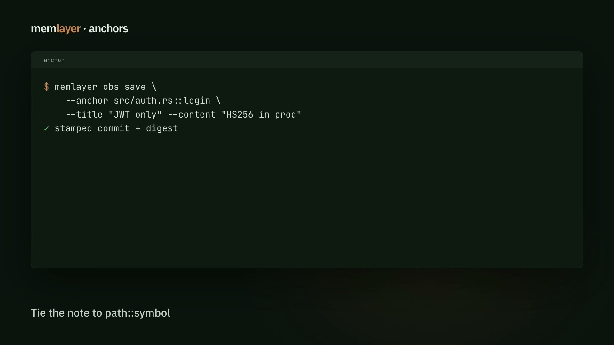
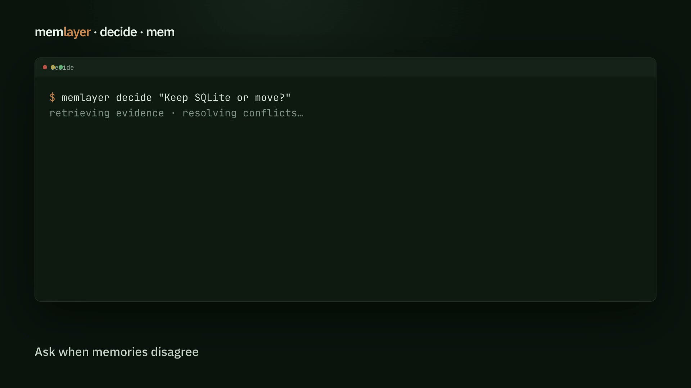

# memlayer

<p align="center">
  
</p>

Persistent memory for AI coding agents — local, per-project, no cloud.

**Docs:** [https://memlayer.org](https://memlayer.org)

memlayer stores decisions, patterns, fixes, and notes in SQLite and surfaces
the right ones when you (or your agent) start the next session. A thin CLI
talks to a per-user daemon over gRPC; agents can also use MCP tools or
shell hooks.

Works with **Claude Code, Cursor, Windsurf, Antigravity, OpenCode, Kimi Code,
ZCode, VS Code / Copilot, Codex, Gemini CLI**, and any agent that can shell
out or speak MCP.

[](https://github.com/sanudatta11/memlayer/actions/workflows/ci.yml)
[](#license)

## Demos

GitHub README strips `<video>` tags, so demos are shown as clickable posters
(full MP4s open on [memlayer.org](https://memlayer.org)).

<p align="center">
  <a href="https://memlayer.org/videos/overview.mp4">
    
  </a>
  <br />
  <em>Overview (click to play) — also on <a href="https://memlayer.org/">memlayer.org</a></em>
</p>

| Demo | Preview (click to play) | Guide |
|---|---|---|
| Install and agents | [](https://memlayer.org/videos/install-agents.mp4) | [Agents / MCP](https://memlayer.org/docs/agents/) |
| Save, search, context | [](https://memlayer.org/videos/save-search-context.mp4) | [Observations](https://memlayer.org/docs/observations/) · [Search and context](https://memlayer.org/docs/search-context/) |
| Anchors and verify | [](https://memlayer.org/videos/anchors-verify.mp4) | [Anchors and verify](https://memlayer.org/docs/anchors-verify/) |
| Decide and mem | [](https://memlayer.org/videos/decide-mem.mp4) | [Decide](https://memlayer.org/docs/decide/) · [Mem archives](https://memlayer.org/docs/mem/) |

Silent terminal-style clips (no narration). Full walkthrough: [Getting started](https://memlayer.org/docs/getting-started/).

## What it does

| Primitive | Command / tool | Purpose |
|---|---|---|
| **Save** | `obs save` / `memory_add` | Capture a decision or fix with context |
| **Brief** | `obs context` / `memory_context` | Topic-ranked memory for the current task |
| **Search** | `obs search` / `memory_search` | Hybrid (BM25 + dense) or BM25; optional agent rerank |

Data lives under `~/.memlayer/` as plain SQLite you can inspect, back up, or delete.

## Install

**Needs:** Rust stable (≥ 1.75), `protoc`, OpenSSL/`pkg-config`, macOS or Linux (WSL OK).

```bash
git clone https://github.com/sanudatta11/memlayer && cd memlayer
make prereqs && make install    # → ~/.local/bin/memlayer
export PATH="$HOME/.local/bin:$PATH"
memlayer --version
```

The daemon auto-starts on first use. Full guide: [Install](https://memlayer.org/docs/install/).

## Quick start

```bash
memlayer obs save \
  --type decision \
  --title "use pgx not GORM" \
  --content "Team prefers raw SQL via pgx" \
  --session "$(uuidgen)"

memlayer obs recent --limit 5
memlayer obs search "pgx"
```

More: [Getting started](https://memlayer.org/docs/getting-started/).

## Wire into your agent

```bash
memlayer install                 # auto-detect agents (like skills.sh)
memlayer install --agent cursor  # one agent (+ shared .agents)
memlayer install --all           # every known target
```

This installs skills/rules, Claude Code hooks (where applicable), and MCP
registration for detected agents. Restart the agent afterward.

**MCP tools:** `memory_search`, `memory_recent`, `memory_context`,
`memory_add`, `memory_facts`, `memory_health`, `memory_decide` — launched as
`memlayer mcp`. Extract / judge / rerank / Decide use the invoking agent's
current model unless you pin `MEMLAYER_LLM_MODEL` or a concrete id.

| Agent | Config touched by install |
|---|---|
| Claude Code | `~/.claude.json`, `.mcp.json` |
| Cursor | `~/.cursor/mcp.json` |
| Windsurf | `~/.codeium/windsurf/mcp_config.json` |
| Antigravity | `~/.gemini/config/mcp_config.json` |
| OpenCode | `~/.config/opencode/opencode.json` |
| Others | Kimi, ZCode, VS Code, Copilot, Codex, Gemini, Amazon Q, `.agents/mcp.json` |

Details: [Wire into your agent](https://memlayer.org/docs/agents/).

## Docs

- [Getting started](https://memlayer.org/docs/getting-started/)
- [Install](https://memlayer.org/docs/install/)
- [Agents / MCP](https://memlayer.org/docs/agents/)
- [Observations](https://memlayer.org/docs/observations/)
- [Search and context](https://memlayer.org/docs/search-context/)
- [Anchors and verify](https://memlayer.org/docs/anchors-verify/)
- [Decide](https://memlayer.org/docs/decide/)
- [Mem archives](https://memlayer.org/docs/mem/)
- [Config](https://memlayer.org/docs/config/)
- [LoCoMo eval](https://memlayer.org/docs/locomo/)
- [Troubleshooting](https://memlayer.org/docs/troubleshooting/)
- [Command cheat sheet](https://memlayer.org/docs/commands/)

## Contributing

See [`CONTRIBUTING.md`](CONTRIBUTING.md) for layout and local build/test.
Architecture and roadmap: [`CLAUDE.md`](CLAUDE.md), [`docs/ROADMAP.md`](docs/ROADMAP.md).

```bash
cargo build --workspace --tests
cargo test --workspace --lib
```

## License

Licensed under either of

- Apache License, Version 2.0 ([`LICENSE-APACHE`](LICENSE-APACHE) or
  https://www.apache.org/licenses/LICENSE-2.0)
- MIT license ([`LICENSE-MIT`](LICENSE-MIT) or
  https://opensource.org/licenses/MIT)

at your option.

Unless you explicitly state otherwise, any contribution intentionally submitted
for inclusion in memlayer by you shall be dual-licensed as above, without any
additional terms or conditions.
