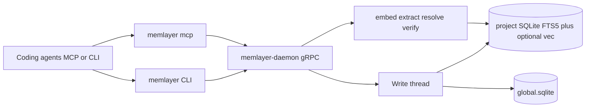

Memlayer is persistent memory for coding agents. Agents talk to a
thin CLI or MCP stdio server; both reach a gRPC daemon that owns
per-project SQLite. Deploy **self-hosted** (local UDS or team TCP) or on
**Memlayer Cloud** (managed SaaS).

## Process diagram

## Components

| Piece | Role |
|---|---|
| **CLI** (`memlayer`) | Thin client; auto-spawns the daemon on first use |
| **MCP** (`memlayer mcp`) | Stdio MCP server exposing `memory_*` tools |
| **Daemon** | gRPC service; one write thread per project |
| **Project DB** | SQLite + FTS5 under `~/.memlayer/`; optional sqlite-vec for hybrid |
| **global.sqlite** | Cross-project BM25 mirror |
| **Workers** | Background pools: embed (BGE-small), extract, resolve, verify |

## Retrieval

Default search/context is **hybrid**: BM25 + dense ANN fused with RRF. On the
self-host path, search and context do not need a third-party search API key.
Optional extract / conflict judge / rerank / Decide shell out to an agent CLI
on `PATH`.

## Deployment modes

| Mode | Who runs the daemon | Status |
|---|---|---|
| **Local UDS** | Your laptop | Shipped (default) |
| **Team TCP+TLS** | Your infra | Shipped (self-host) |
| **Memlayer Cloud** | Us (managed SaaS) | Product offering |

Self-host data lives under `~/.memlayer/` (inspect, backup, delete). Cloud
uses the same client surfaces (CLI / MCP) with hosted storage and ops.

See also: [Self-hosting and Cloud](/docs/self-hosting/), [Why memlayer](/docs/why-memlayer/),
[Config](/docs/config/).
